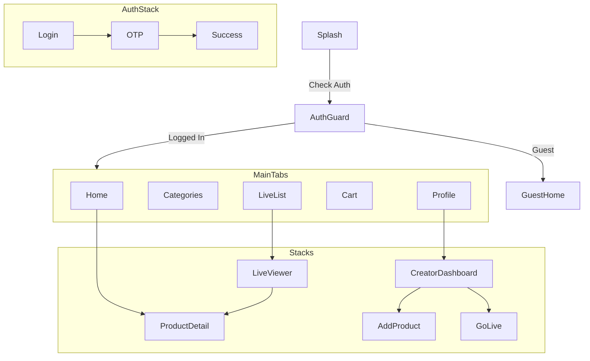

# Lumina Live - Frontend Architecture & Navigation Plan

**Version:** 1.0.0
**Target Frameworks:** Flutter (Material 3) OR React Native (Expo)

This document outlines the production-grade architecture for the Lumina Live mobile application.

---

## 1. Folder Structure Tree

This structure is designed for scalability, grouping files by **feature** rather than by type.

```
src/
├── assets/                 # Images, Fonts, Icons
│   ├── fonts/
│   ├── images/
│   └── icons/
├── config/                 # Environment variables, API urls
│   └── env.ts
├── core/                   # Core application logic
│   ├── theme/              # Design System (Tokens)
│   │   ├── colors.ts
│   │   ├── typography.ts
│   │   ├── spacing.ts
│   │   └── index.ts
│   ├── utils/              # Helper functions
│   │   └── formatters.ts
│   └── constants/          # App-wide constants
├── components/             # Shared UI Components (Atomic Design)
│   ├── atoms/              # Buttons, Inputs, Icons
│   ├── molecules/          # Cards, ListItems
│   └── organisms/          # Headers, Footers
├── features/               # Feature-based Modules
│   ├── auth/
│   │   ├── screens/        # Login, Signup, OTP
│   │   └── components/     # Auth-specific widgets
│   ├── shop/
│   │   ├── screens/        # Home, ProductDetail, Cart
│   │   └── components/     # ProductCard, CartItem
│   ├── live/
│   │   ├── screens/        # LiveList, LiveViewer
│   │   └── components/     # ChatOverlay, HeartAnimation
│   └── creator/
│       ├── screens/        # Dashboard, GoLive
│       └── components/     # AnalyticsChart
├── navigation/             # Navigation Configuration
│   ├── AppNavigator.tsx    # Root Navigator
│   ├── AuthNavigator.tsx   # Auth Stack
│   ├── MainTabNavigator.tsx# Bottom Tabs
│   └── routes.ts           # Route Name Constants
├── services/               # API Services (Axios/Dio)
│   ├── api.ts
│   └── auth.service.ts
└── store/                  # State Management (Zustand/Riverpod/Bloc)
    ├── useAuthStore.ts
    └── useCartStore.ts
```

---

## 2. Navigation Architecture

### Flow Diagram



---

## 3. Flutter Navigation Code (GoRouter)

**File:** `lib/navigation/app_router.dart`

```dart
import 'package:go_router/go_router.dart';
import 'package:flutter_riverpod/flutter_riverpod.dart';

final goRouterProvider = Provider<GoRouter>((ref) {
  final authState = ref.watch(authProvider);

  return GoRouter(
    initialLocation: '/',
    redirect: (context, state) {
      final isLoggedIn = authState.isAuthenticated;
      final isGoingToAuth = state.matchedLocation.startsWith('/auth');

      if (!isLoggedIn && !isGoingToAuth) return '/auth/login';
      if (isLoggedIn && isGoingToAuth) return '/home';
      return null;
    },
    routes: [
      GoRoute(
        path: '/',
        builder: (context, state) => const SplashScreen(),
      ),
      GoRoute(
        path: '/auth/login',
        builder: (context, state) => const LoginScreen(),
      ),
      ShellRoute(
        builder: (context, state, child) => MainScaffold(child: child),
        routes: [
          GoRoute(path: '/home', builder: (context, state) => const HomeScreen()),
          GoRoute(path: '/live', builder: (context, state) => const LiveListScreen()),
          GoRoute(path: '/cart', builder: (context, state) => const CartScreen()),
          GoRoute(path: '/profile', builder: (context, state) => const ProfileScreen()),
        ],
      ),
      GoRoute(
        path: '/product/:id',
        builder: (context, state) => ProductDetailScreen(id: state.pathParameters['id']!),
      ),
      GoRoute(
        path: '/live/:id',
        builder: (context, state) => LiveViewerScreen(id: state.pathParameters['id']!),
      ),
    ],
  );
});
```

---

## 4. React Native Navigation Code (React Navigation)

**File:** `src/navigation/RootNavigator.tsx`

```typescript
import React from 'react';
import { NavigationContainer } from '@react-navigation/native';
import { createNativeStackNavigator } from '@react-navigation/native-stack';
import { createBottomTabNavigator } from '@react-navigation/bottom-tabs';
import { useAuth } from '../store/useAuth';

const Stack = createNativeStackNavigator();
const Tab = createBottomTabNavigator();

function MainTabs() {
  return (
    <Tab.Navigator screenOptions={{ headerShown: false }}>
      <Tab.Screen name="Home" component={HomeScreen} />
      <Tab.Screen name="Live" component={LiveListScreen} />
      <Tab.Screen name="Cart" component={CartScreen} />
      <Tab.Screen name="Profile" component={ProfileScreen} />
    </Tab.Navigator>
  );
}

export function RootNavigator() {
  const { isAuthenticated, isLoading } = useAuth();

  if (isLoading) return <SplashScreen />;

  return (
    <NavigationContainer>
      <Stack.Navigator screenOptions={{ headerShown: false }}>
        {!isAuthenticated ? (
          // Auth Stack
          <Stack.Group>
            <Stack.Screen name="Login" component={LoginScreen} />
            <Stack.Screen name="Signup" component={SignupScreen} />
          </Stack.Group>
        ) : (
          // App Stack
          <Stack.Group>
            <Stack.Screen name="Main" component={MainTabs} />
            <Stack.Screen name="ProductDetail" component={ProductDetailScreen} />
            <Stack.Screen name="LiveViewer" component={LiveViewerScreen} />
            <Stack.Screen name="CreatorDashboard" component={CreatorDashboard} />
          </Stack.Group>
        )}
      </Stack.Navigator>
    </NavigationContainer>
  );
}
```

---

## 5. Best Practices Checklist

1.  **Type Safety:** Always define a `RootStackParamList` in TypeScript or use Code Generation in GoRouter to prevent invalid route navigation.
2.  **Lazy Loading:** Load heavy screens (like `LiveViewer`) lazily to improve app startup time.
3.  **Deep Linking:** Configure `linking` props in React Navigation or `path` in GoRouter to support `lumina://product/123` urls from marketing emails.
4.  **Auth Guards:** Never rely solely on UI hiding. Ensure navigation logic redirects unauthenticated users at the router level.
5.  **Clean Imports:** Use path aliases (e.g., `@features/auth`) to avoid `../../../` hell.
